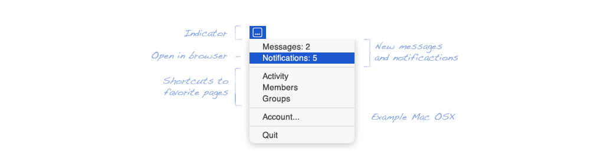

# ElggConnect - Easy desktop access to your Elgg-Network




ElggConnect is a desktop application for accessing your Elgg Network. You get informed of new messages and notifications or
easily visit your favorite Elgg-Network-Pages with custom shortcuts.


## Requirements

- A favorite text editor or IDE
- Java SE Development Kit 8 (JDK) 1.8 or later 
- Elgg Network with activated Elgg-Plugin [elgg_connect](https://github.com/ElggConnect/elgg_connect.git)

## Getting started


#### Copy or clone the Repo
```
git clone https://github.com/ElggConnect/ElggConnect.git
```
#### Create configuration-file

* **Copy** *doc/elgconnect.properties.example* into */src/main/resources/config/*
* **Rename** the file to *elgconnect.properties*
* **Customize** elgconnect.properties

```
# Required base url with trailing slash
baseurl=http://example.tld/

# Standard values for application window; change if desired
appname=ElggConnect
subline=Easy access to your Network
image=/images/png/logo.png

```

## Run ElggConnect with gradle for testing

CD to your elggconnect-directory and execute the following terminal command:

```
Unix        ./gradlew run
Windows     gradlew.bat run

```

## Deploy ElggConnect as a native package

CD to your elggconnect-directory and execute the following terminal command:

```
Unix        ./gradlew jfxDeploy
Windows     gradlew.bat jfxDeploy

```

After a successful build process you find the application in the directory elggconnect/build/distributions/

To build your application for other operating systems, you need to perform the steps above on a desired operating system.

## Hints

* If the error "JAVA\_HOME is set to an invalid directory ..." appears, see [docs.oracle.com](http://docs.oracle.com/cd/E19182-01/820-7851/inst_cli_jdk_javahome_t/index.html)